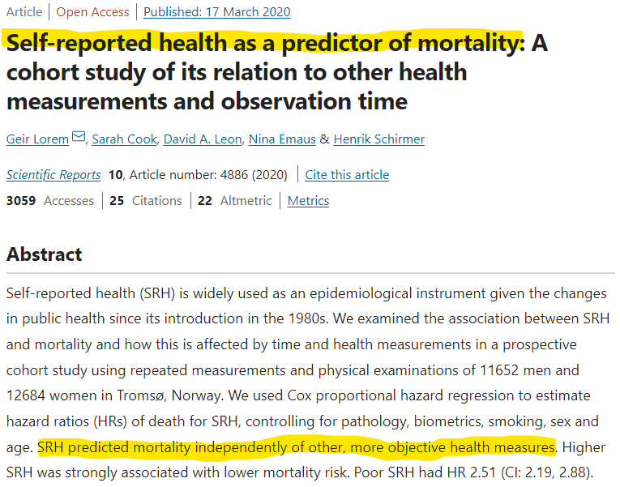

```{r setup, include = FALSE, echo= FALSE, message=FALSE, warning=FALSE}
library(knitr) # for knitting
library(tidyverse) # ggplot and friends
library(NHSRtheme) # slide template comes from here
library(haven) # calling stata files
library(broom) # tidy function to make data tidy
library(kableExtra) # makes data frames pretty when you knit
library(psych) # descriptive stats
library(xaringanExtra) 
use_panelset() # function to make panel sets

# xaringan::inf_mr() 
    # if you run the above command directly in the Rstudio console, it will let 
    # you see your presentation slides in the rstudio "viewer" panel every time 
    # you edit the markdown file. Otherwise, you have to constantly knit to 
    # browser to see your edits render.

# tried setting default options for image size but struggled a lot with this part
opts_chunk$set(echo = FALSE,
               fig.width = 6,
               fig.height = 3,
               dpi = 300)

# uncomment the following lines if you want to use the NHS-R theme colors by default
scale_fill_continuous <- partial(scale_fill_nhs, discrete = FALSE)
scale_fill_discrete <- partial(scale_fill_nhs, discrete = TRUE)
scale_colour_continuous <- partial(scale_colour_nhs, discrete = FALSE)
scale_colour_discrete <- partial(scale_colour_nhs, discrete = TRUE)

theme_update(plot.title = element_text(hjust = 0.5)) # centers plot titles
theme_update(plot.subtitle = element_text(hjust = 0.5)) # centers subtitles

```


```{r load-and-prep data}
gss21_raw <- read_stata("data/gss21.dta") 

gss21 <- gss21_raw%>% 
  select(id, year, sex, hlthmntl, hlthphys) %>% 
  na.omit(hlthphys)

gss18_raw <- read_stata("data/gss18.dta") 

gss18 <- gss18_raw%>% 
  select(id, year, sex, hlthmntl, hlthphys) %>% 
  na.omit(hlthphys)

# merge gss 2018 & 2018
gss_merged <- rbind(gss18, gss21) %>% 
  mutate(year = as.factor(year)) %>%       # Make year be numeric
  mutate(mental_health =                   # Create new variable `mental_health`
           as.numeric(                     # Make `mental_health numeric
             ifelse(hlthmntl == 1, 5,      # Reverse code `mental_health`
                    ifelse(hlthmntl == 2, 4,
                           ifelse(hlthmntl == 3, 3,
                                  ifelse(hlthmntl == 4, 2, 
                                         ifelse(hlthmntl == 5, 1, ""
                                         ))))))) %>% 
  mutate(physical_health =  # there's probably a better way to do this
           as.numeric(
             ifelse(hlthphys == 1, 5,
                    ifelse(hlthphys == 2, 4,
                           ifelse(hlthphys == 3, 3,
                                  ifelse(hlthphys == 4, 2, 
                                         ifelse(hlthphys == 5, 1, ""
                                         )))))))


gss18_correlations <- read_stata("data/gss18.dta") %>% 
  select(id, year, sex, hlthmntl, hlthphys, educ, rincom16, race, race6)%>% 
  mutate(rincom16_int = as.integer(rincom16)) %>% 
  mutate(year = as.factor(year)) %>%       # Make year be numeric
  mutate(mental_health =                   # Create new variable `mental_health`
           as.integer(                     # Make `mental_health numeric
             ifelse(hlthmntl == 1, 5,      # Reverse code `mental_health`
                    ifelse(hlthmntl == 2, 4,
                           ifelse(hlthmntl == 3, 3,
                                  ifelse(hlthmntl == 4, 2, 
                                         ifelse(hlthmntl == 5, 1, ""
                                         ))))))) %>% 
  mutate(physical_health = 
           as.integer(
             ifelse(hlthphys == 1, 5,
                    ifelse(hlthphys == 2, 4,
                           ifelse(hlthphys == 3, 3,
                                  ifelse(hlthphys == 4, 2, 
                                         ifelse(hlthphys == 5, 1, ""
                                         ))))))) %>% 
  na.omit() %>% 
  zap_labels()

# summarize health by year
health_by_year <- gss_merged %>%
  group_by(year) %>% 
  summarize(avg_phys_health = mean(physical_health),
            sd_phys_health = sd(physical_health),
            avg_mntl_health = mean (mental_health),
            sd_mntl_health = sd(mental_health)) %>% 
  mutate(mental_health = "mental health",
         physical_health = "physical health",
         yeargroup = ifelse(year == "2018", "2018","2021"))

```

class: title-slide, left, bottom

# `r rmarkdown::metadata$title`
----
## **`r rmarkdown::metadata$subtitle`**
### `r rmarkdown::metadata$author`
### `r rmarkdown::metadata$date`

---
class: inverse, center, middle

# Topic: Self-rated health

# Field: Health research

# Data: GSS 2018 & 2021

---

# Self-rated health

.pull-left[

### What is it?

Self-rated health refers to the question where participants rate different dimensions of their own health; it is commonly used in health research.

]

--

.pull-right[


### Example

#### On a scale from 1-5, how would you rate your physical (or mental) health?

**5. Excellent**

**4. Very good**

**3. Good**

**2. Fair**

**1. Poor**

]

---
class: inverse, center, middle

# Why is self-rated health important?

---
# Relevance

<!-- start of panel set -->

.panelset[

.panel[.panel-name[Relevance: Mortality]

.pull-left[



]

.pull-right[

<html style="height: 100%;"><head><meta name="viewport" content="width=device-width, minimum-scale=0.1"><title>41598_2020_61603_Fig1_HTML.png (997×701)</title><style type="text/css"></style></head><body style="margin: 0px; background: #0e0e0e; height: 100%"><iframe id="zotero-modal-prompt" src="chrome-extension://ekhagklcjbdpajgpjgmbionohlpdbjgc/modalPrompt/modalPrompt.html" style="position: fixed; top: 0px; left: unset; right: 0px; width: 50%; height: 50%; border: none; display: none; z-index: 2147483647;"></iframe></body></html>

]

]<!-- end-of-panel -->
.panel[.panel-name[Relevance: Education]

.pull-left[

```{r educ-mental-health-cor, warning=FALSE, echo=FALSE, message=FALSE, fig.height=3, fig.width=3.5}

ggplot(gss18_correlations, aes(y = educ, 
                               x = as.factor(mental_health), 
                               color = mental_health)) +
  geom_point(position = position_jitter(width = .2, seed = 1234), 
             alpha = 0.5) +
  geom_smooth(method = "lm") +
  scale_x_discrete(labels=c("1" = "Poor", 
                            "2" = "Fair",
                            "3" = "Good", 
                            "4" = "Very good", 
                            "5"= "Excellent")) +
  scale_y_continuous(breaks=c(8, 12, 16, 20), limits = c(8,20)) +
  theme(axis.text.x = element_text(angle=45, face = "bold"), 
        legend.position = "none") +
  labs(x = "Mental health",
       y = "Education",
       subtitle = "GSS 2018")
```

]

.pull-right[

```{r cor-educ}

tidy(
  cor.test(gss18_correlations$educ, gss18_correlations$mental_health)) %>% 
  kbl(caption = "Correlation: Education ~ Mental Health", digits = 2) %>% 
  kable_styling(bootstrap_options = "striped", full_width = FALSE)
```

]

]<!-- end-of-panel -->
.panel[.panel-name[Relevance: Income]

.pull-left[

```{r income-mental-health-correlation, warning=FALSE, message=FALSE, echo=FALSE, fig.height=3, fig.width=3.5}

ggplot(gss18_correlations, aes(y = rincom16_int, 
                               x = as.factor(physical_health), 
                               color = physical_health)) +
  geom_point(position = position_jitter(width = .25, seed = 1234), alpha = 0.5) +
  geom_smooth(method = "lm", ) +
  scale_x_discrete(labels=c("1" = "Poor", 
                            "2" = "Fair",
                            "3" = "Good", 
                            "4" = "Very good", 
                            "5"= "Excellent")) +
  scale_y_discrete(labels=c("1" = 1000,
                            "10" = 25000,
                            "20" = 65000)) +
  theme(axis.text.x = element_text(angle=45, face= "bold"), 
        legend.position = "none") +
  labs(x = "Physical health",
       y = "Income",
       subtitle = "GSS 2018")

```

]

.pull-right[

```{r cor-income}

tidy(
  cor.test(gss18_correlations$rincom16, gss18_correlations$physical_health)) %>% 
  kbl(caption = "Correlation: Income ~ Physical health", digits = 2) %>% 
  kable_styling(bootstrap_options = "striped", full_width = FALSE, latex_options = "scale_down")

```

]

]<!-- end-of-panel -->
.panel[.panel-name[Relevance: Race]

```{r}
mental_health_by_race <- gss18_correlations %>% 
  group_by(race6) %>% 
  summarize(mean_mental_health = mean(mental_health),
            mean_physical_health = mean(physical_health))
``` 

.center[

### GSS 2018 Mental health by race

```{r mental-health-by-race, fig.height=2.25, fig.width=3.75, dpi=200}

ggplot(mental_health_by_race, aes(y = mean_mental_health, 
                               x = as.factor(race6), 
                               color = race6)) +
  geom_point(size = 3, position = position_jitter(seed=1234, width = .15)) +
  scale_x_discrete(labels=c("1" = "White", 
                            "2" = "Black",
                            "3" = "American Indian", 
                            "4" = "Asian", 
                            "5"= "Native Hawaiian")) +
  theme(axis.text.x = element_text(angle=25), 
        legend.position = "none") +
  labs(x = NULL,
       y = "Mental Health") +
  ylim(3.4, 3.8)

```

]

]<!-- end of panel -->
]

---
class: inverse, center

# What's the takeaway from all that?

--

.left[
### If we ask people to self-rate their health...
]

--

.left[
### then we can use their answers to predict things like their mortality...
]
--

.left[
### and if we  know who is at risk of early mortality...
]

--

.center[
# **then we can do something beforehand to prevent it!!!!**
]

---

# Physical health

.pull-left[

### In the GSS 2018, respondents (n = 2328) were asked... 

#### "In general, how would you rate your <u>physical health</u>?"

**5. Excellent**

**4. Very good**

**3. Good**

**2. Fair**

**1. Poor**

]

--

.pull-right[

```{r physical-health-2018, echo=FALSE, fig.height=3, fig.width=4, dpi=700}
# ggplot(health_by_year, aes(x = year, 
#                            y = avg_phys_health,
#                            color = physical_health,
#                            group = physical_health)) +
#   annotate("point", x = 2018, y = 3.335481, size = 2, color = "red") +
#   xlim(2017, 2021) +
#   ylim(3.25, 3.4) +
#   labs(y = "Physical health")

ggplot(filter(gss_merged, year == 2018), aes(x = physical_health)) +
  geom_bar(fill = "red") +
  geom_vline(xintercept = 3.34, size = 1.5) +
  labs(subtitle = "Physical health",
       xlab = "")
```

**M** = 3.34

**SD** = 1.08

]

---

# Mental health

.pull-left[

### In the GSS 2018, respondents (n = 2328) were asked... 

#### "In general, how would you rate your <u>mental health</u>?"

**5. Excellent**

**4. Very good**

**3. Good**

**2. Fair**

**1. Poor**

]

--

.pull-right[

```{r mental-health-18, echo=FALSE, fig.height=3, fig.width=4, dpi=700}
# ggplot(health_by_year, aes(x = year, 
#                            y = avg_phys_health,
#                            color = physical_health,
#                            group = physical_health,
#                            label = value)) +
#   annotate("point", x = 2018, y = 3.661942, size = 2, color = "blue") +
#   xlim(2017, 2021) +
#   ylim(3.60, 3.70) +
#   labs(y = "Mental health")


ggplot(filter(gss_merged, year == 2018), aes(x = mental_health)) +
  geom_bar(fill = "blue") +
  geom_vline(xintercept = 3.66, size = 1.5) +
  labs(subtitle = "Mental health",
       xlab = "")

```

```{r echo=FALSE, fig.show='hide'}
# describe(x = filter(gss_merged )) when you're not sleepy find Heiss' example of filtering data. Need to filter year == 2021


```

**M** = 3.66

**SD** = .97

]

---

class: inverse, center, middle

# Our hypothesis:

## The Covid-19 pandemic impacted people's physical and mental health.

---

class: inverse, center, middle


# Our research question: 

## Is there a significant difference in the averages for self-rated physical and mental health in 2018 vs 2021?

---

class: center

# Graphic representation

<!-- start of panel -->
.panelset[

.panel[.panel-name[Physical '18]
  
```{r physical-health-201, fig.height=2.25, fig.width=3.75, dpi=200, warning=FALSE, message=FALSE}

ggplot(health_by_year, aes(x = year, 
                           y = avg_phys_health,
                           color = physical_health,
                           group = physical_health)) +
  annotate("point", x = 2018, y = 3.335481, size = 2, color = "red") +
  xlim(2017, 2021)+
  ylim(3.25, 3.4) +
  labs(title = "Average physical health for U.S. adults",
       subtitle = "2018",
       y = "average")
```

M = 

] <!-- end of panel -->
.panel[.panel-name[Physical '21]

```{r physical-health-2, fig.height=2.25, fig.width=3.75, dpi=200}

ggplot(health_by_year, aes(x = year, 
                           y = avg_phys_health, 
                           color = physical_health,
                           group = physical_health,
                           label = avg_phys_health)) +
  geom_point(size = 2, color = "red") +
  geom_line(color = "red") +
  ylim(3.25, 3.4) +
  labs(title = "Average physical health for U.S. adults",
       subtitle = "2018 vs 2021",
       y = "Average")
```

] <!-- end of panel -->
.panel[.panel-name[Mental '18]

```{r mental-health-1, fig.height=2.25, fig.width=3.75, dpi=200}
ggplot(health_by_year, aes(x = year, 
                           y = avg_phys_health,
                           color = physical_health,
                           group = physical_health)) +
  annotate("point", x = 2018, y = 3.661942, size = 2, color = "blue") +
  xlim(2017, 2021) +
  ylim(3,4) +
  labs(title = "Average mental health for U.S. adults",
       subtitle = "2018",
       y = "average")

```

] <!-- end of panel -->
.panel[.panel-name[Mental '21]

```{r mental-health-2, fig.height=2.25, fig.width=3.75, dpi=200}
ggplot(health_by_year, aes(x = year, 
                           y = avg_mntl_health, 
                           color = mental_health,
                           group = mental_health,
                           label = avg_mntl_health)) +
  geom_point(size = 2, color = "blue") +
  geom_line(color = "blue") +
  ylim(3, 4) +
  labs(title = "Average mental health for U.S. adults",
       subtitle = "2018 vs 2021",
       y = "average") 
  

```

] <!-- end of panel -->
.panel[.panel-name[Physical & Mental 18-21]

```{r full-plot, echo=FALSE, message=FALSE , fig.height=2.25, fig.width=3.75, dpi=200}

ggplot(health_by_year, aes(x = year, 
                           y = avg_mntl_health)) +
  annotate("point", x = 2018, y = 3.661942, size = 2, color = "blue" ) +
  annotate("point", x = 2021, y = 3.484899, size = 2, color = "blue") +
  annotate("point", x = 2018, y = 3.335481, size = 2, color = "red") +
  annotate("point", x = 2021, y = 3.327515, size = 2, color = "red") +
  annotate("segment", 
           x = 2018, xend = 2021, 
           y = 3.661942, yend = 3.484899, 
           color = "blue") +
  annotate("segment", 
           x = 2018, xend = 2021, 
           y = 3.335481, yend = 3.327515, 
           color = "red") +
  scale_x_discrete(labels=c("2018","2021")) +  ## trying to add 2021 to tick label, not working
  geom_vline(xintercept = 2019.5, ) +
  xlim(2016, 2023) +
  ylim(3, 4) +
  labs(title= "Physical and mental health",
       subtitle = "2018 vs 2021",
       y = "average")
```

]<!-- end of panel -->
]

---
class: inverse, center, middle

# Are these differences statistically significant??

---

# Methods

<!-- start of panel set -->

.panelset[

.panel[.panel-name[Statistical method]

### **Independent samples ttest**

* Ttest (comparing averages)

* Independent observations

] <!-- end of panel -->
.panel[.panel-name[Variable definition]

### **Independent variable**

* year (nominal)

### **Dependent variables**

* physical health (interval)

* mental health (interval)

]<!-- end of panel -->

.panel[.panel-name[Data cleaning]

### **Merge**

* Make 2018 & 2021 GSS into one dataset

### **Reverse code**

* 1 (excellent) --> 5
* 2 (very good) --> 4
* 3 (good) --> 3
* 4 (fair) --> 2
* 5 (poor) --> 1

] <!-- end of panel -->
.panel[.panel-name[Hypothesis testing]

###**Null hypothesis**: 

* There is no difference in mean averages in 2018 and 2021.

### **Alternate hypothesis**: 

* There is a difference in mean averages in 2018 and 2021.

### **Test type**

* two-tailed

### **Alpha level**

* 0.05

] <!-- end of panel -->
]

---
class: inverse, center, middle

# Findings

---

# Findings: mental health

.center[

```{r findings-mental, echo=FALSE, warning=FALSE, message=FALSE}

tidy(t.test(mental_health ~ year, data = gss_merged))  %>% 
  rename("difference" = "estimate",
         "2018" = "estimate1",
         "2021" = "estimate2") %>% 
  kable(digits = 2, format = "html")

```


```{r mental-health-23, fig.height=2.15, fig.width=3.65, dpi=200, echo=FALSE}
ggplot(health_by_year, aes(x = year, 
                           y = avg_mntl_health, 
                           color = mental_health,
                           group = mental_health,
                           label = avg_mntl_health)) +
  geom_point(size = 2, color = "blue") +
  geom_line(color = "blue") +
  ylim(3, 4) +
  labs(subtitle = "Mental health",
       y = "average") 
  
```

]

---

# Findings: physical health

.center[

```{r findings-physical, echo=FALSE, warning=FALSE, message=TRUE}

tidy(t.test(physical_health ~ year, data = gss_merged)) %>% 
  rename("difference" = "estimate",
         "2018" = "estimate1",
         "2021" = "estimate2") %>% 
  kable(digits = 2, format = "html")
```


```{r physical-health-22, fig.height=2.15, fig.width=3.65, dpi=200, echo=FALSE}

ggplot(health_by_year, aes(x = year, 
                           y = avg_phys_health, 
                           color = physical_health,
                           group = physical_health,
                           label = avg_phys_health)) +
  geom_point(size = 2, color = "red") +
  geom_line(color = "red") +
  ylim(3.25, 3.4) +
  labs(subtitle = "Physical health",
       y = "average")
```

]
---

class: inverse, center, middle

# Conclusions

---

# Conclusions

.panelset[

.panel[.panel-name[Write Up]

We conducted two independent samples t-tests to determine if self-rated physical and mental health among U.S. adults differed in 2018 vs 2021. We found there to be a statistically significant difference for mental health (p < 0.001). However, we did not find there to be a statistically significant difference for physical health (p = 0.78).


]<!-- end of panel -->
.panel[.panel-name[Limitations]

* Possible violation of t-test assumption

* Survey methodology

]<!-- end of panel -->
.panel[.panel-name[Future implications]

Future research should investigate how mental health and physical health changed over time among subpopulations such as gender, race, ethnicity, and SES. 

]<!-- end of panel -->

]

---

background-image:url(https://jrossrecruiters.com/sites/default/files/styles/blog_promoted_image/public/field/image/any-questions.jpg?itok=6THzQGhb)

background-size:cover

---

# This presentation was made using:

<!-- start of panel set -->
.panelset[

.panel[.panel-name[R programming]


#### What is it? 

R is a programming language for statistical computing and graphics that you can use to clean, analyze, and graph your data. It is widely used by researchers from diverse disciplines to estimate and display results and by teachers of statistics and research methods. Most importantly, it's completely free!

#### Where can I learn more?

[Dr. Audrey Leroux](https://education.gsu.edu/profile/audrey-leroux/), assistant professor of research in the College of Education at GSU  teaches R programming in the course EPRS 8600 Computer Use in Education. If you are a GSU student and would like to learn how to analyze data in R, consider enrolling in the course!

[Dr. Andrew Heiss](https://aysps.gsu.edu/profile/andrew-heiss/) is an assistant professor in the Andrew Young School of Policy Studies at Georgia State University, as well as a certified [R/Rstudio instructor](https://education.rstudio.com/trainers/people/heiss+andrew/). He teaches R programming in his courses such as PMAP 8101 Data Visualization and PMAP 8521 Evaluation Research. Best of all, Dr. Heiss has made his [entire teaching catalog](https://www.andrewheiss.com/teaching/) available online for FREE, meaning you can access his content on R programming without having to enroll in his course!


]<!-- end of panel -->
.panel[.panel-name[Xaringan]

Xaringan (pronounced "Sharingan") is a package within R that allows you to make HTML presentations. If you have ever used Microsoft Powerpoint before, then Xaringan serves a similar purpose but with additional capabilities. If you'd like to learn more about Xaringan, below are some helpful resources:

- a [brief guide](https://bookdown.org/yihui/rmarkdown/xaringan.html) on how to use Xaringan
- a [video workshop](https://www.youtube.com/watch?v=M3skTMQbCD0&t=2099s) on how to use Xaringan (part 1)
- a [video workshop](https://www.youtube.com/watch?v=cAtpZxW4bTI) on how to use Xaringan (part 2)

]<!-- end of panel -->

.panel[.panel-name[Citations]

Lorem, G., Cook, S., Leon, D.A. et al. Self-reported health as a predictor of mortality: A cohort study of its relation to other health measurements and observation time. Sci Rep 10, 4886 (2020). https://doi.org/10.1038/s41598-020-61603-0

]<!-- end of panel -->
]

---

# About me


James is a graduate student at Georgia State University earning his M.S. in Research, Measurement, and Statistics. Prior to this, James lived and worked in his home state of North Carolina. He earned his Bachelor's degree in Spanish as well as a Master of Arts in Teaching both from the University of North Carolina at Chapel Hill. After graduating, he taught high school Spanish for 5 years and later went on to help underserved high school students gain admission to College. James is fiercely passionate about equity in education and uses quantitative research methods to tell stories and make a meaningful impact on society. When he's not conducting research, James enjoys traveling, having interesting one on one conversations, and practicing his language skills.